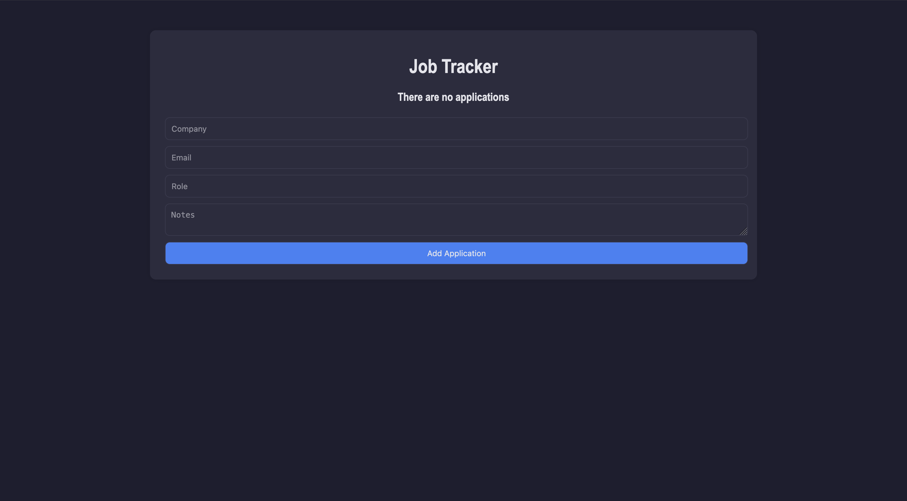
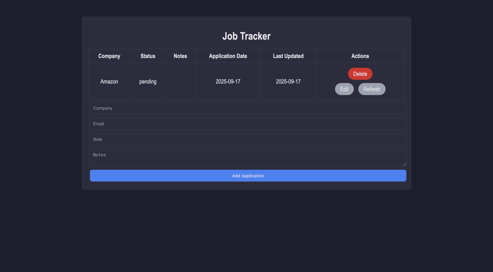
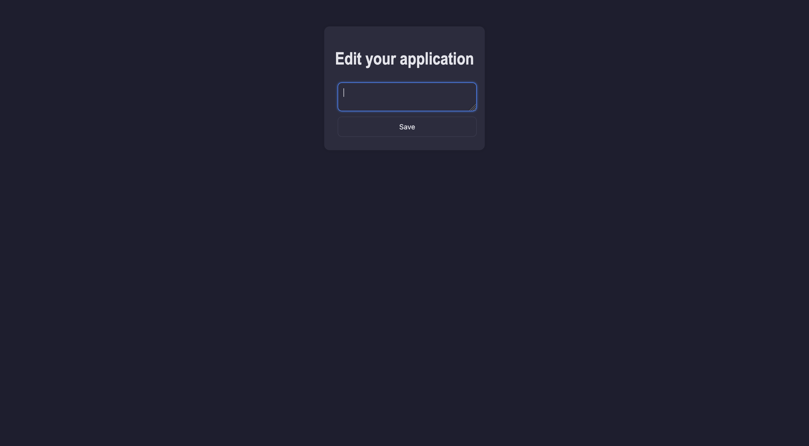

# Job Application Tracker

A personal macOS desktop application to track job and internship applications. It can update application status by scanning your email inbox for specific keywords to determine if you've been accepted or rejected.

---

## Features

- **Native macOS App:** Launch the tracker directly from your Dock as a standalone window.
- **Email Status Sync:** Automatically update application status by scanning recruiter emails.
- **Application Management:** Add and track company names, roles, recruiter emails, and custom notes.
- **Secure Credentials:** Utilizes a `.env` file to keep your email app passwords safe.
- **No Browser Required:** Uses a native window wrapper so it doesn't clutter your web browser tabs.

---

## Setup

1. **Clone the repository**
```bash
   git clone https://github.com/AaronPazCastelan/job-tracker.git
   cd job-tracker
```

2. **Create virtual env**
```bash
   python3 -m venv env
   source env/bin/activate
```

3. **Install the dependencies**
```bash
   pip install -r requirements.txt
   pip install py2app
```

4. **Set up your environment variables**
   Copy the example file and fill in your credentials:
```bash
   cp .env.example .env
```
   Then open `.env` and replace the placeholder values:
```
   EMAIL_USER=your_email@gmail.com
   EMAIL_PASS=your_app_password
```
   > **Note:** Use a generated app password (not your main password).

---

## Making it a Mac App

1. **Build the application**
```bash
   python3 setup.py py2app
```

2. **Install to Applications**
   Open the newly created `dist/` folder and drag `Job Tracker.app` into your Applications folder.

3. **Add to Dock**
   Drag the app from your Applications folder onto your Dock for easy one-click access.

---

## Screenshots

### Homepage (Empty)


### Homepage


### Edit Page


---

## Upcoming Features

- Filtering and search for applications
- Automatic background status updates
- Support for multiple email accounts
- Increase status accuracy